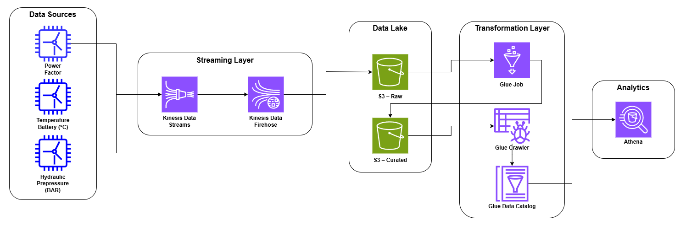

# AWS Wind Farm Data Pipeline

**Pipeline de ingestão em streaming com transformação serverless na AWS.**

#### Projeto de Engenharia de Dados para monitoramento de sensores de uma fazenda eólica, processando dados de simuladores, armazenando em um Data Lake e disponibilizando relatórios com AWS Athena.

**Capacidades do Pipeline:**

- Ingestão contínua de eventos simulados
- Conversão JSON → Parquet
- Redução de custo analítico com Athena
- Detecção de valores fora do padrão

---

## Resumo

- **Tipo de pipeline:** Hybrid Data Pipeline
- **Fonte:** Simuladores com Python
- **Data Lake:** AWS S3
- **Transformação:** AWS Glue Job
- **Consumo:** AWS Athena

---

## Sobre o projeto
Sensores em uma fazenda eólica são dispositivos de monitoramento e controle essenciais para a operação segura, eficiente e automática das turbinas eólicas. Os dados desses sensores precisam ser coletados quase em tempo real para que se possa reduzir custos de manutenção através de monitoramento preditivo e assegurar a integridade física do equipamento contra ventos fortes ou falhas.

Este projeto demonstra:

- Construção de pipeline de dados ponta a ponta na nuvem
- Arquitetura híbrida para ingestão contínua e processamento analítico
- Controle de gastos via compute serverless

**Objetivo:** Detectar comportamentos anômalos nos sensores durante a operação das turbinas.

---

## Arquitetura do pipeline


Fluxo dos dados:

Python → Kinesis Data Streams → Kinesis Data Firehose → S3 Raw → Glue Job → S3 Curated → Glue Data Catalog → Athena

Etapas:

1. Simuladores em Python geram eventos JSON
2. Kinesis Data Streams recebe os eventos em tempo real
3. Kinesis Firehose entrega os dados no S3 (camada raw)
4. AWS Glue Job trata e transforma os dados para Parquet
5. AWS Glue Crawler detecta schemas e atualiza o Glue Data Catalog
6. Athena consulta os dados catalogados da camada curated

---

## Stack Tecnológica

| Camada         | Tecnologia                | Uso no Projeto                               |
|----------------|---------------------------|----------------------------------------------|
| Fonte de Dados | Python                    | Gera eventos simulados em JSON               |
| Ingestão       | AWS Kinesis Data Streams  | Recebe eventos quase em tempo real           |
| Entrega        | AWS Kinesis Data Firehose | Entrega os dados no Data Lake                |
| Data Lake      | AWS S3                    | Armazena os dados brutos e tratados          |
| Transformação  | AWS Glue Job              | Transforma e carrega dados na camada curated | 
| Catalogação    | AWS Glue Crawler          | Detecta esquemas e atualiza tabelas          |
| Metadados      | AWS Glue Data Catalog     | Armazena metadados para consulta no Athena   |
| Analítica      | AWS Athena                | Executa consultas analíticas                 |

---

## Estrutura do Projeto

### Local
```text
.
├── docs/
├── src/
│   ├── ingestion/
│   │   └── stream_writer.py
│   ├── processing/
│   │   └── transform_job.py
│   ├── producers/
│   │   ├── hydraulic_prepressure.py
│   │   ├── power_factor.py
│   │   └── temperature_battery.py
│   ├── sql/
│   │   ├── analytics/
│   │   │   └── registro_intervalo_datas.sql
│   │   └── ddl/
│   └── pipeline.py
├── .env.example
├── .gitignore
├── README.md
└── requirements.txt
```

### S3

```text
s3://meu-bucket/
├── raw/
│   └── 2026/...
└── curated/
    └── 2026/...

s3://meu-bucket-assets/
├── scripts/
├── logs/
├── temp/
└── queries/
```

---

## Como Executar

### Pré-requisitos

- Conta na AWS
- Python 3.11+

### Passos
1. Clone o repositório:

```bash
git clone https://github.com/gustavocljesus/aws-kinesis-glue-athena-pipeline.git
```

2. Instale as dependências:

```bash
pip install -r requirements.txt
```
> Lembre-se de criar um ambiente virtual: 
> ```bash
> python -m venv .venv
> ```

3. Configure os serviços na AWS

4. Execute o arquivo ``pipeline.py`` disponível em ``src/``

5. Configure o Glue Job semelhante ao arquivo ``docs/glue-visual-ETL.png``

6. Efetue as consultas disponíveis em ``sql/analytics/``

---

## Próximos passos
- [ ] Tornar os simuladores mais realistas
- [ ] Garantir idempotência no pipeline
- [ ] Adicionar monitoramento com AWS CloudWatch
- [ ] Enviar alertas automáticos com AWS SNS
- [ ] Automatizar o pipeline com Terraform